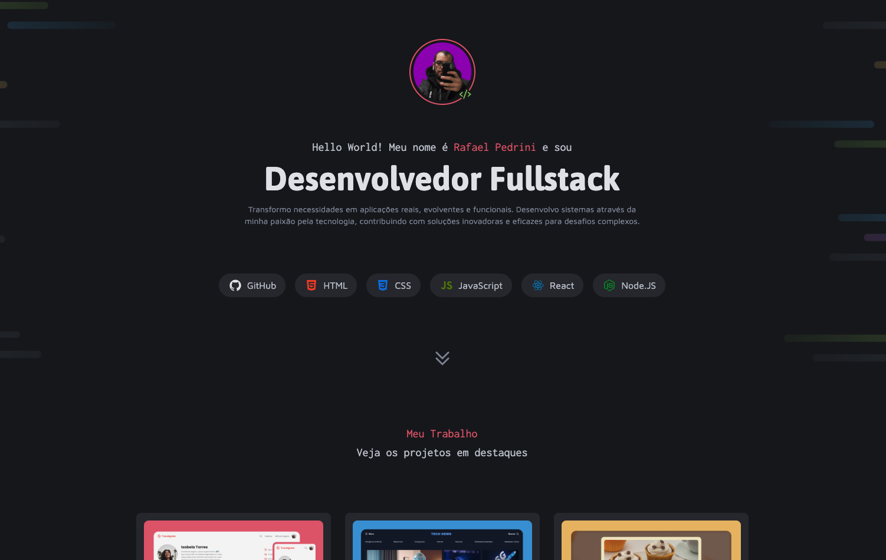

# 🚀 Portfólio Dev - Rafael Pedrini



## 📋 Sobre o Projeto

Este é o meu portfólio pessoal desenvolvido para apresentar minha experiência como **Desenvolvedor Fullstack**. O projeto demonstra minhas habilidades técnicas através de uma interface moderna e responsiva, destacando meus projetos e serviços oferecidos.

**🔗 Link do Projeto:** [https://rafaelrhp.github.io/projeto-portfolio-dev/](https://rafaelrhp.github.io/projeto-portfolio-dev/)

## ✨ Características

- **Design Moderno**: Interface limpa e profissional com tema escuro
- **Responsivo**: Adaptável para diferentes tamanhos de tela
- **Performance Otimizada**: Carregamento rápido e eficiente
- **Acessibilidade**: Desenvolvido seguindo boas práticas de acessibilidade
- **SEO Friendly**: Estrutura semântica para melhor indexação

## 🛠️ Tecnologias Utilizadas

- **HTML5** - Estrutura semântica
- **CSS3** - Estilização e layout responsivo
- **JavaScript** - Interatividade
- **React** - Framework JavaScript
- **Node.js** - Runtime JavaScript
- **GitHub** - Versionamento e deploy

## 📁 Estrutura do Projeto

```
projeto-portfolio-dev/
├── assets/
│   ├── icons/          # Ícones das tecnologias
│   ├── img/            # Imagens dos projetos
│   ├── links/          # Ícones das redes sociais
│   └── me.png          # Foto de perfil
├── styles/
│   ├── global.css      # Estilos globais
│   ├── header.css      # Estilos do cabeçalho
│   ├── projetos.css    # Estilos da seção de projetos
│   ├── services.css    # Estilos da seção de serviços
│   ├── contato.css     # Estilos da seção de contato
│   ├── tags.css        # Estilos das tags de tecnologias
│   └── utility.css     # Classes utilitárias
└── index.html          # Página principal
```

## 🎯 Seções do Portfólio

### 👨‍💻 Sobre Mim

- Apresentação pessoal
- Descrição profissional
- Stack de tecnologias dominadas

### 💼 Projetos em Destaque

1. **Travelgram** - Rede social para compartilhamento de viagens
2. **Tech News** - Portal de notícias sobre tecnologia
3. **Página de Receita** - Site com receitas de cupcakes
4. **Zingen** - Landing page de aplicativo de Karaokê
5. **Refund** - Sistema de pedido e acompanhamento de reembolso
6. **Página de Turismo** - Informações sobre viagem para Busan

### 🔧 Serviços Oferecidos

- **Websites e Aplicativos** - Desenvolvimento de interfaces
- **API e Banco de Dados** - Criação de serviços do sistema
- **DevOps** - Gestão e infraestrutura da aplicação

### 📞 Contato

- LinkedIn
- Instagram
- GitHub
- E-mail

## 🚀 Como Executar o Projeto

1. **Clone o repositório**

   ```bash
   git clone https://github.com/rafaelrhp/projeto-portfolio-dev.git
   ```

2. **Navegue até o diretório**

   ```bash
   cd projeto-portfolio-dev
   ```

3. **Abra o arquivo index.html**
   - Duplo clique no arquivo `index.html`
   - Ou abra através de um servidor local

## 📱 Responsividade

O portfólio foi desenvolvido pensando na experiência do usuário em diferentes dispositivos:

- ✅ Desktop
- ✅ Tablet
- ✅ Mobile

## 🎨 Design System

- **Cores**: Tema escuro com acentos em vermelho e verde
- **Tipografia**: Fontes modernas (Asap, Inconsolata, Maven Pro)
- **Layout**: Grid e Flexbox para organização
- **Ícones**: SVG para melhor qualidade e performance

## 📈 Melhorias Futuras

- [ ] Adicionar animações CSS
- [ ] Implementar modo claro/escuro
- [ ] Adicionar blog integrado
- [ ] Implementar formulário de contato
- [ ] Adicionar mais projetos
- [ ] Otimizar SEO

## 👨‍💻 Sobre o Desenvolvedor

**Rafael Pedrini** - Desenvolvedor Fullstack apaixonado por tecnologia e inovação. Transformo necessidades em aplicações reais, evolventes e funcionais, contribuindo com soluções inovadoras e eficazes para desafios complexos.

## 📞 Contato

- **LinkedIn**: [rafaelrhp](https://www.linkedin.com/in/rafaelrhp/)
- **Instagram**: [@rafael.rhp](https://www.instagram.com/rafael.rhp/)
- **GitHub**: [rafaelrhp](https://github.com/rafaelrhp)

## 📄 Licença

Este projeto está sob a licença MIT. Veja o arquivo [LICENSE](LICENSE) para mais detalhes.

---

⭐ Se este projeto te ajudou, considere dar uma estrela no repositório!
